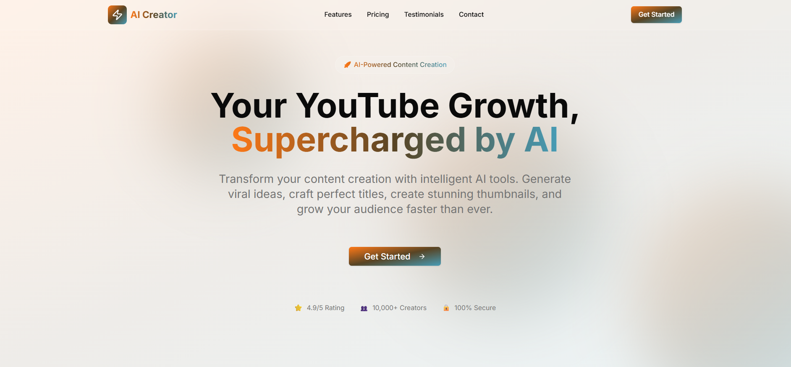
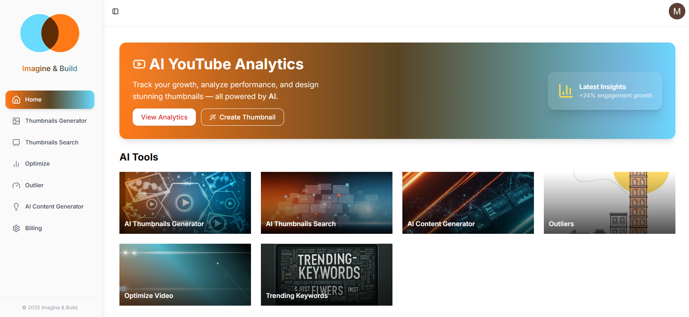
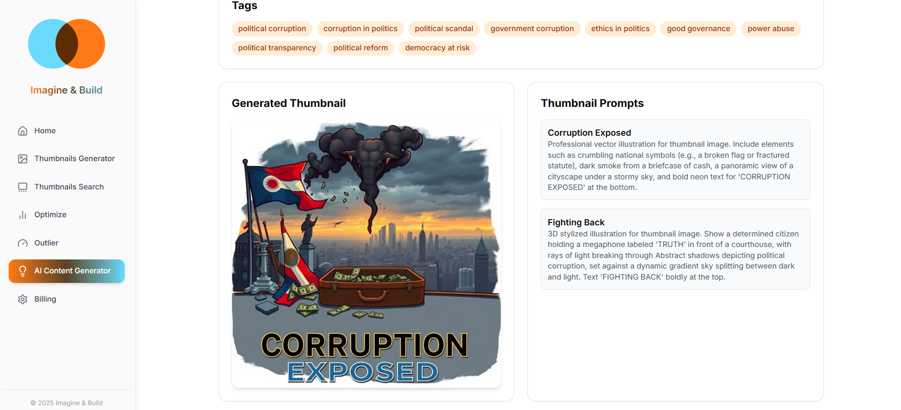
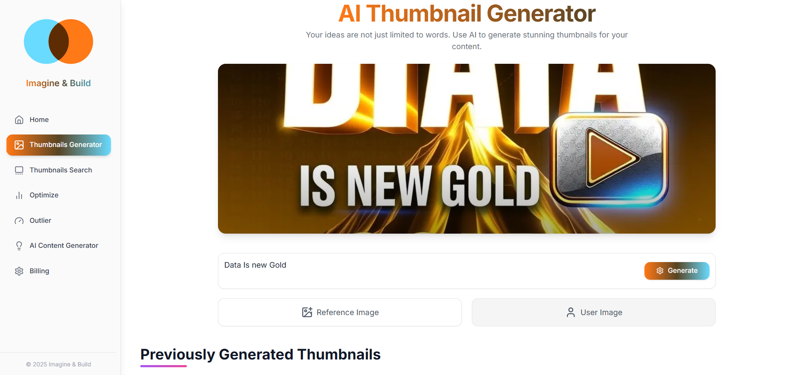
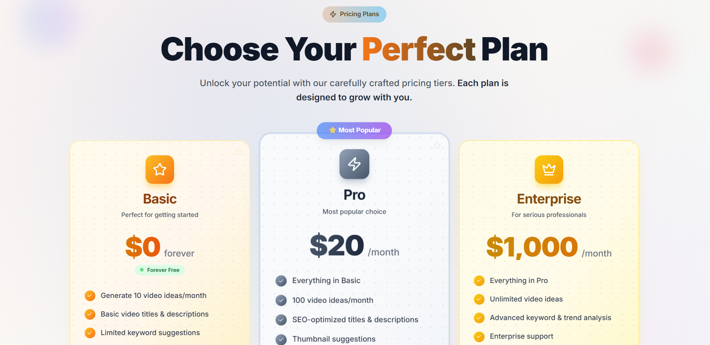

# YouTube Content Generator

An AI-powered web application that helps YouTube creators generate optimized content ideas, titles, descriptions, tags, and thumbnails. Built with modern web technologies, it leverages AI models for content creation and image generation to supercharge channel growth.

## Description

This project is a full-stack Next.js application designed to assist YouTube creators in producing high-quality, SEO-optimized content. Users can input video ideas or topics, and the AI generates:
- SEO-optimized titles with scores
- Engaging descriptions
- Relevant tags
- Thumbnail prompts and AI-generated thumbnails

The app includes user authentication, a dashboard, billing integration, and background processing for AI tasks. It uses serverless functions for efficient AI workflows and integrates with cloud services for image handling.

## Features

- **AI Content Generator**: Input a topic to generate titles, descriptions, tags, and thumbnail prompts.
- **AI Thumbnail Generator**: Generate custom thumbnails based on user input, reference images, or user photos.
- **Dashboard**: Overview of features and welcome banner.
- **Billing & Checkout**: Subscription plans with Stripe integration (via Clerk).
- **Authentication**: Secure sign-in/sign-up using Clerk.
- **Outlier Detection**: Analyze video performance outliers.
- **Trending Keywords & Thumbnail Search**: Discover trends and search thumbnails.
- **Responsive Design**: Mobile-friendly UI with dark mode support.
- **Background Processing**: Uses Inngest for asynchronous AI tasks like content and image generation.

## Tech Stack

### Frontend
- **Next.js**: React framework for server-side rendering and API routes.
- **React**: UI library for building interactive components.
- **Tailwind CSS**: Utility-first CSS framework for styling.
- **Shadcn UI**: Reusable UI components (e.g., buttons, cards, tooltips).
- **Framer Motion**: For animations and transitions.
- **Lucide React**: Icon library.

### Backend & Database
- **Next.js API Routes**: Handles API endpoints for AI generation and user data.
- **Drizzle ORM**: Type-safe ORM for PostgreSQL queries.
- **Neon Database**: Serverless PostgreSQL database.
- **Inngest**: Serverless event-driven workflows for background jobs (e.g., AI processing).

### AI & Integrations
- **OpenRouter (OpenAI-compatible)**: For generating content (titles, descriptions, tags) using models like Mistral.
- **Cloudflare AI Workers**: Image generation using Flux-1 model.
- **ImageKit**: Image upload, storage, and optimization.
- **Replicate**: Optional AI model integration (e.g., Stable Diffusion for thumbnails).
- **Axios**: For HTTP requests.

### Authentication & Others
- **Clerk**: User authentication and management.
- **Stripe**: Billing and subscriptions (integrated via Clerk).
- **Moment.js**: Date handling.
- **Sharp**: Image processing (e.g., resizing thumbnails).

### Development Tools
- **TypeScript**: For type safety.
- **ESLint & Prettier**: Code linting and formatting.
- **Vercel**: Recommended for deployment.

## Installation

1. Clone the repository:
   ```
   git clone https://github.com/manavsaini124/youtube-content-generator.git
   cd youtube-content-generator
   ```

2. Install dependencies:
   ```
   npm install
   # or
   yarn install
   # or
   pnpm install
   ```

3. Set up environment variables: Create a `.env` file in the root directory and add the following (replace with your own keys):
   ```
   NEXT_PUBLIC_NEON_DB_CONNECTION_STRING=your-neon-db-url
   CLERK_SECRET_KEY=your-clerk-secret
   OPEN_ROUTER_API_KEY=your-openrouter-key
   CLOUDFARE_API_KEY=your-cloudflare-key
   CLOUDFLARE_ACCOUNT_ID=your-cloudflare-account-id
   IMAGEKIT_PUBLIC_KEY=your-imagekit-public
   IMAGEKIT_PRIVATE_KEY=your-imagekit-private
   IMAGEKIT_URL_ENDPOINT=your-imagekit-url
   REPLICATE_API_KEY=your-replicate-key
   INNGEST_SIGNING_KEY=your-inngest-key
   INNGEST_SERVER_URL=https://api.inngest.com/v1/events
   GEMINI_API_KEY=your-gemini-key (optional)
   ```

4. Set up the database:
   ```
   npx drizzle-kit push
   npx drizzle-kit studio  # Optional: Open Drizzle Studio for DB management
   ```

5. Run the development server:
   ```
   npm run dev
   # or
   yarn dev
   ```
   Open [http://localhost:3000](http://localhost:3000) in your browser.

6. For background jobs (Inngest):
   ```
   npm run inngest
   ```

## Usage

1. **Sign Up/In**: Use Clerk authentication to create an account.
2. **Dashboard**: Navigate to features like AI Content Generator or Thumbnail Generator.
3. **Generate Content**: Enter a video topic in the AI Content Generator page to get titles, descriptions, tags, and a thumbnail.
4. **Generate Thumbnail**: Provide input, optional reference/user images, and generate AI thumbnails.
5. **Billing**: Subscribe to premium plans for advanced features.

## Screenshots

### Home Page

*Landing page with hero section and features overview.*

### Dashboard

*User dashboard showing welcome banner and feature list.*

### AI Content Generator

*Interface for generating video titles, descriptions, tags, and thumbnails.*

### AI Thumbnail Generator

*Tool for creating custom thumbnails with AI, including upload previews and generated results.*

### Billing Page

*Subscription plans with features and pricing.*

*(Note: Replace the screenshot paths with actual images from your project. You can add them to a `screenshots/` folder in the repo.)*

## Contributing

Contributions are welcome! Please follow these steps:
1. Fork the repository.
2. Create a new branch (`git checkout -b feature/YourFeature`).
3. Commit your changes (`git commit -m 'Add YourFeature'`).
4. Push to the branch (`git push origin feature/YourFeature`).
5. Open a Pull Request.

## License

This project is licensed under the MIT License. See the [LICENSE](LICENSE) file for details.

## Acknowledgements

- Built with [Next.js](https://nextjs.org/)
- AI powered by [OpenRouter](https://openrouter.ai/) and [Cloudflare AI](https://developers.cloudflare.com/workers-ai/)
- Thanks to the open-source community for libraries like Shadcn UI and Drizzle ORM.

For any issues or questions, open an [issue](https://github.com/manavsaini124/youtube-content-generator/issues) on GitHub.